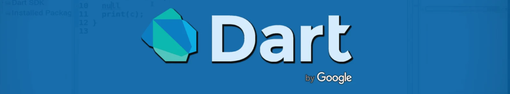

## ✔️ [Curso Dart](https://github.com/vanessavargas/curso-dart/tree/master/curso-dart)
Curso introdutório sobre programação de computadores utilizando como linguagem o Dart, canal Deivid Willyan | Flutter
Conteúdo estudado no curso:
- Variáveis e Tipos
- Null Safety
- Estruturas de Fluxo
- Estruturas de repetição
- Classes, Métodos e Atributos
- Programação Orientada a Objetos (POO)
- Interfaces, Herança e Polimorfismo
- Future, Async e Awai
- Mapas
- JSON
- Callable Interface (CALL)
- Tratamento de Erros: Exceptions
- Enum
- Extensions
- Enhanced Enum

## ✔️ [Formação Alura: A partir do zero: crie projetos em Dart, a linguagem utilizada no Flutter](https://github.com/vanessavargas/curso-dart/tree/master/formacao_dart_alura)
Conteúdo estudado nesta formação: 
- Vantagens e desvantagens da utilização do Dart nos projetos;
- Instalação e utilização de ferramentas;
- O que são variáveis, listas, laços de repetição e boas práticas da linguagem;
- Paradigma de orientação a objetos, aplicado ao Dart;
- Sintaxe e dinamismo na linguagem de programação;
- Exceções;
- Sincronismo.
